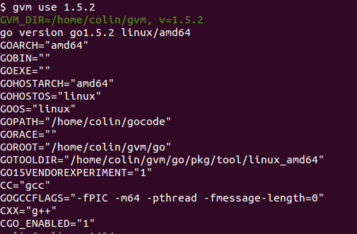
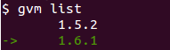

# GOLANG version manager

Only for linux amd64

### Usage

#### step 1

download gvm and put it in your home dir

#### step 2

write to .bashrc

```
export GOPATH=$HOME/gocode
. $HOME/gvm/gvmrc
```

then run `. ~/.bashrc`

#### step 3

link gvm/gvm.sh to /usr/local/bin dir

```sh
ln -s $HOME/gvm/gvm.sh /usr/local/bin/gvm
```

#### step 4

install go

```sh
gvm install 1.6.1
gvm install 1.5.2
...
```

you can change go version by using

```sh
gvm use 1.5.2
```


```sh
gvm list
```


### Notice

before use `gvm`, you must remove the old golang installation and env setting
